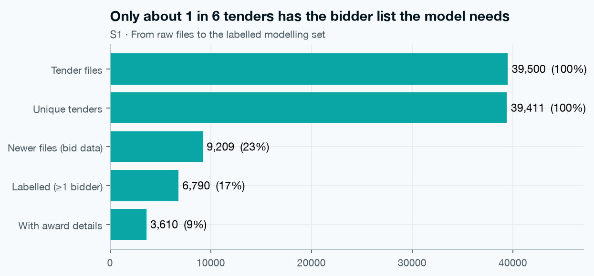
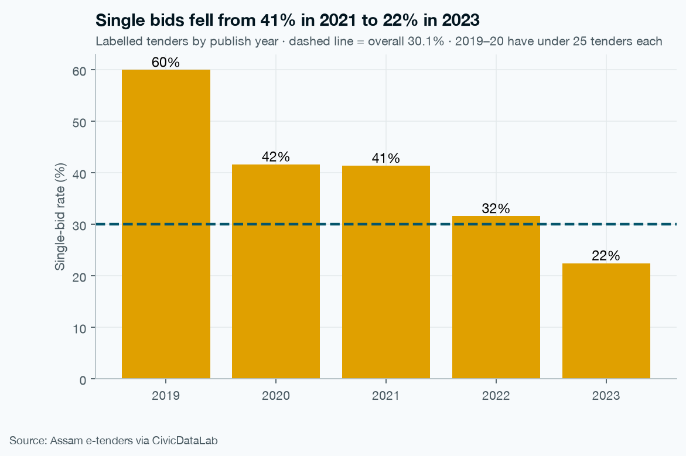
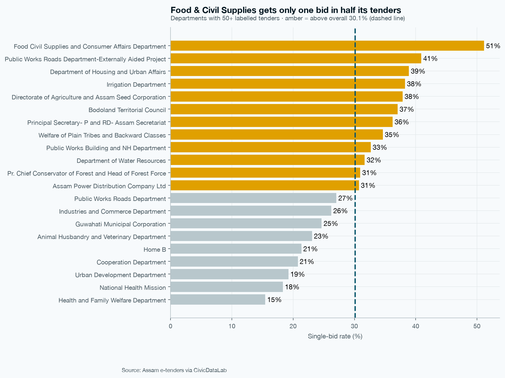
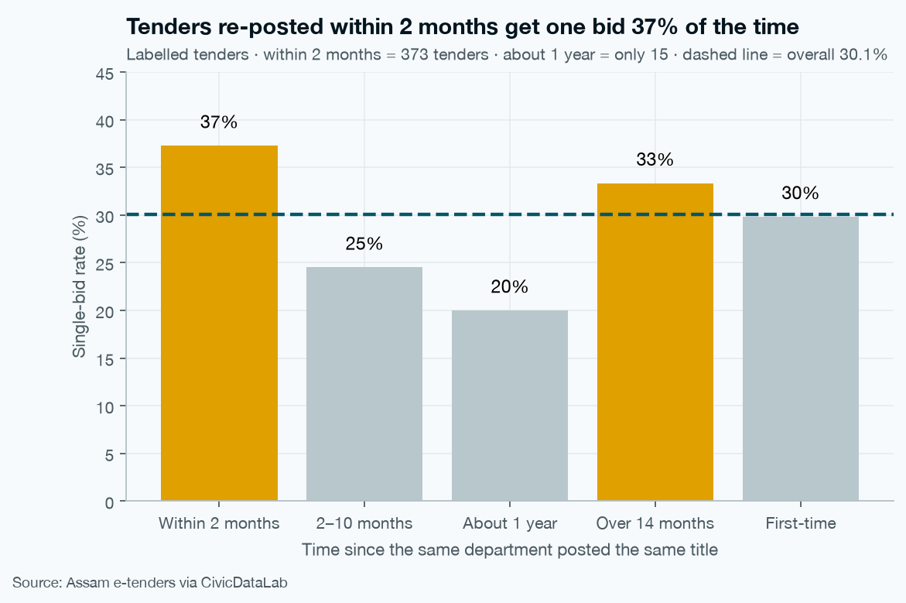

# TenderLens: Predicting Single-Bid Government Tenders in Assam

**A machine learning project that learns from 39,000+ real Assam government e-tenders to flag which new tenders are likely to get only one bid, so auditors know where to look first.**

> This is a screening tool, not fraud detection. A single bid does not mean anything wrong happened. It only means the tender had no competition, which is worth a closer look.

---

## Project Progress

| Section | Status | Highlights |
|---|---|---|
| S1 Data audit | Done | 39,500 tender files checked, 6,790 have a bidder list |
| S2 Cleaning | Done | 16 cleaning steps, 39,411 unique tenders, cleaning log and data dictionary saved |
| S3 EDA and SQL | Done | 30.1% of tenders got only one bid, 7 charts, results checked again in SQLite |
| S4 Features and time split | Next | |
| S5 Baseline and ML models | Planned | |
| S6 NLP on tender titles | Planned | |
| S7 Final model and SHAP | Planned | |
| S8 Anomaly detection | Planned | |
| S9 Deep learning | Planned | |
| S10 Streamlit app | Planned | |
| S11 Report and slides | Planned | |

---

## Business Understanding

When a government office posts a tender, it wants many companies to bid. More bids usually means better prices and fairer selection.

When only one company bids, there is no competition. Sometimes there is a simple reason (very specialised work, remote location). But a high share of single-bid tenders is a known warning sign in public spending.

Auditors cannot check every tender by hand. The question for this project is:

- Can past tenders help predict which new tenders are likely to get only one bid?
- And can we explain why, so the result is useful and not a black box?

---

## Data Understanding

- **Source:** Assam e-tenders portal, collected and shared by [CivicDataLab](https://github.com/CivicDataLab/assam-tenders-data).
- **Period:** April 2016 to May 2023.
- **Size:** 39,500 CSV files, one file per tender.
- Each file has the tender details in the first row, and lists (bidders, documents) in the rows below.
- Older files do not have a bidder list. Only newer files tell us how many companies bid.

| Stage | Count |
|---|---|
| Tender files | 39,500 |
| Unique tenders (after removing 89 duplicates) | 39,411 |
| Tenders with a bidder list (usable for the target) | 6,790 |
| Single-bid tenders | 2,044 (30.1%) |

The raw data is not in this repo because it is large and has company names. You can download it from the CivicDataLab link above.

---

## Data Preparation

I cleaned the data in 16 steps (notebook 02). Main things I did:

- Removed 89 duplicate tender IDs.
- Fixed dates and turned them into proper date columns.
- Made the target column: 1 = only one bid, 0 = more than one bid. Tenders with no bidder list stay unknown (not 0).
- Kept missing values as missing for now. They will be filled in S4 using training data only, so no information leaks from the future.
- Saved every change in `reports/cleaning_log.csv` and described every column in `reports/data_dictionary.csv`.

---

## Key Findings (S3)

**1. Single-bid tenders are going down over time.**
41% in 2021, 32% in 2022, 22% in 2023 (Jan to May).

**2. Some offices see far more single bids than others.**
Among the 21 offices with at least 50 tenders, Food and Civil Supplies is highest at 51% (about 1 in 2). Health and Family Welfare is lowest at 15% (about 1 in 7). 12 of 21 offices are above the overall 30%.

**3. Tenders posted again soon are the strongest signal so far.**
When the same office posts the same tender again within 1 to 60 days, 40% get only one bid, compared to about 30% for first-time tenders.

**4. December 2022 was unusual.**
1,794 tenders were posted in one month (normal is about 400 to 550), mostly road works and health. Only 19% got a single bid. This looks like a year-end budget rush.

**5. Bid window length and tender value are weak signals on their own.**
Single-bid rates stay between 28% and 34% across bid window bands. Tenders with no value listed show fewer single bids (23% vs 31%), mostly because goods-buying offices often leave value blank.

All S3 numbers were checked a second time with SQL queries in SQLite (`sql/eda_queries.sql`).

---

## Methodology (planned)

- Time-based split: train on tenders up to Sep 2022, validate on Oct to Dec 2022, test on Jan to May 2023. The test set is used only once at the end.
- Compare a simple rule benchmark with Logistic Regression, Random Forest and XGBoost.
- Handle class imbalance with class weights and threshold tuning.
- Explain predictions with SHAP.
- Separately flag unusual tenders with Isolation Forest.
- Show everything in a Streamlit app.

---

## Limitations

- Only 6,790 tenders have a bidder list, so the model learns from a smaller part of the data.
- The single-bid rate is changing over time (36% in training, 23% in test), so the model must be checked for this drift.
- A single bid is a signal for review, not proof of wrongdoing.

---

## Project Structure & How to Run

Note: the notebooks will move into a `notebooks/` folder in the next update.

To run:

1. Download the raw data from [CivicDataLab](https://github.com/CivicDataLab/assam-tenders-data) and place the zip in `data/raw/`.
2. Install the libraries: `pip install -r requirements.txt`
3. Run the notebooks in order: 01, 02, 03.

---

## Acknowledgements

- Data: Assam e-tenders portal via [CivicDataLab](https://github.com/CivicDataLab/assam-tenders-data).
- Capstone Project 2, PG Data Analytics, Imarticus Learning.

**Sindhu Sharma Marupaka** · [GitHub](https://github.com/sindhusharmamarupaka) · [LinkedIn](https://www.linkedin.com/in/sindhu-sharma-data-analyst)
